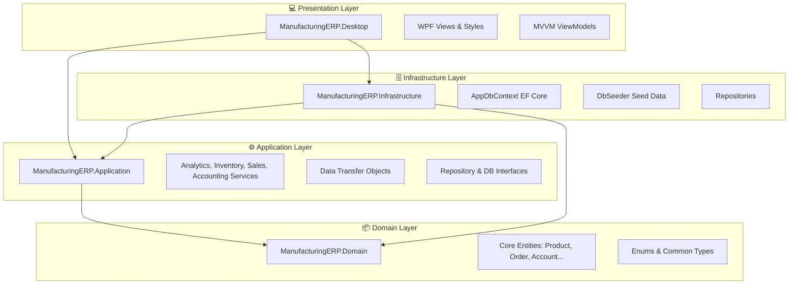

# 🏭 ManufacturingERP Desktop Solution

[](https://dotnet.microsoft.com/download/dotnet/8.0)
[]()
[]()

A comprehensive, production-ready ERP desktop application template designed for small-to-medium manufacturing operations. It features key modules spanning warehouse management, production control, route distribution, van sales, collections, and dual-layer accounting.

---

## 📸 Screenshots


---

## 🏗️ Solution Architecture

The solution is built using **Clean Architecture** principles, enforcing separation of concerns, testability, and a clear flow of dependencies.



### 🗂️ Layer Breakdown

1. **`ManufacturingERP.Desktop` (WPF UI)**
   * Built on the MVVM (Model-View-ViewModel) pattern using the `CommunityToolkit.Mvvm` package.
   * Utilizes `MaterialDesignThemes` for a modern, sleek dark/light themed interface.
   * Standardizes visual elements with customized styles (e.g. `Styles.xaml`).

2. **`ManufacturingERP.Application` (Services & Logic)**
   * Contains core application logic, services (like [AnalyticsService](file:///c:/Projects/ManufacturingERP/src/ManufacturingERP.Application/Services/AnalyticsService.cs)), and DTOs.
   * Defines interfaces and abstractions to decouple the domain from the underlying persistence layer.

3. **`ManufacturingERP.Domain` (Entities & Abstractions)**
   * Contains core domain models (e.g., `Product`, `Customer`, `ProductionOrder`, `Account`).
   * Expresses business rules, enums, and domain behavior without any external infrastructure dependencies.

4. **`ManufacturingERP.Infrastructure` (Data Persistence)**
   * Implements EF Core with SQLite backend for light-footprint local databases.
   * Configures tables, relations, and indexes in `AppDbContext`.
   * Integrates a seeder (`DbSeeder`) containing mock data for quick developer bootstrapping.

5. **`ManufacturingERP.Shared` (Utilities & Helpers)**
   * Houses project-wide cross-cutting helpers, constants, and utilities.

---

## 🛠️ Modules & Features

### 📈 1. Executive Dashboard & Analytics
* **Summary Cards**: Quick-glance metrics for Monthly Sales, Collections, Supplier Payables, Customer Receivables, and Total Inventory Value.
* **Operational Control**: Direct insights from the [AnalyticsService](file:///c:/Projects/ManufacturingERP/src/ManufacturingERP.Application/Services/AnalyticsService.cs) showing charts, trends, and recent transaction logs.

### 🛒 2. POS & Vehicle Sales
* **POS Sales**: Quick checkout terminal for over-the-counter cash sales.
* **Vehicle & Route Sales**: Supports distribution scenarios where sales reps carry stock on vehicles and issue invoices on active routes.

### 📦 3. Warehouse & Inventory Control
* **Physical Stock Counts**: Track inventory balances across multiple physical warehouses.
* **Movement Log**: Log transactions for stock additions, adjustments, and purchase returns.

### ⚙️ 4. Production & Manufacturing Costing
* **Production Orders**: Initiate, schedule, and track production batches.
* **Production Costing**: Automated calculations breaking down costs into **Raw Materials**, **Direct Labor**, and **Factory Overheads** to derive accurate unit costs.

### 📒 5. Accounting & Ledger Management
* **Chart of Accounts Setup**: Initialize and structure asset, liability, equity, revenue, and expense accounts.
* **Journal Entries**: Post manual and automated entries to double-entry ledgers.
* **Statements Printing**: Export clean, professional customer and supplier account statements directly to HTML with embedded previews.

### 🛡️ 6. Administration & Security
* **User Management**: Add/modify users with role-based permissions (Administrator, Manager, Operator).
* **Command-Level Authorization**: Enforces permission checks on sensitive actions (e.g., editing ledger parameters, posting journals, finalizing sales).
* **Audit Logs**: Transparent logs capturing user sessions and core mutations.
* **Database Explorer**: Integrated view permitting system administrators to directly query and inspect local database states.

---

## ⚙️ Technology Stack & Dependencies

* **Runtime**: .NET 8.0 SDK
* **WPF Framework**: standard Windows presentation framework
* **MVVM Framework**: [CommunityToolkit.Mvvm](https://www.nuget.org/packages/CommunityToolkit.Mvvm/)
* **Material Design**: [MaterialDesignThemes](https://www.nuget.org/packages/MaterialDesignThemes/) & [MaterialDesignColors](https://www.nuget.org/packages/MaterialDesignColors/)
* **ORM Engine**: Entity Framework Core (`Microsoft.EntityFrameworkCore.Sqlite`, `Microsoft.EntityFrameworkCore.Design`)
* **Reports Export**: Ready for HTML-based export and [FastReport](https://www.fastreport.ru/en/) integration

---

## 🚀 Getting Started

### Prerequisites
* **Windows OS**
* **.NET 8.0 SDK** (or later)
* **Visual Studio 2022** or **VS Code** with C# Dev Kit extension

### Quick Setup

1. **Clone & Open**: Clone the repository and navigate to the project directory:
   ```bash
   git clone <repository-url>
   cd ManufacturingERP
   ```
2. **Restore NuGet Packages**:
   ```bash
   dotnet restore
   ```
3. **Build the Solution**:
   ```bash
   dotnet build
   ```
4. **Run the Application**:
   Set `ManufacturingERP.Desktop` as your startup project and run:
   ```bash
   dotnet run --project src/ManufacturingERP.Desktop/ManufacturingERP.Desktop.csproj
   ```

---
