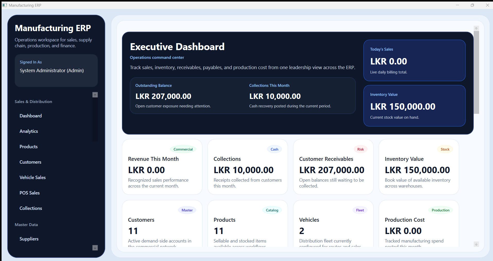
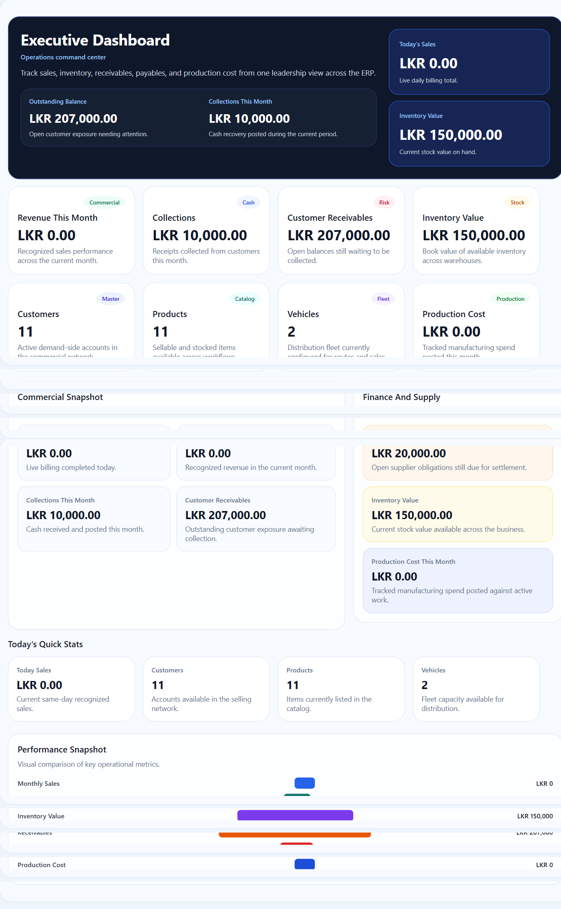
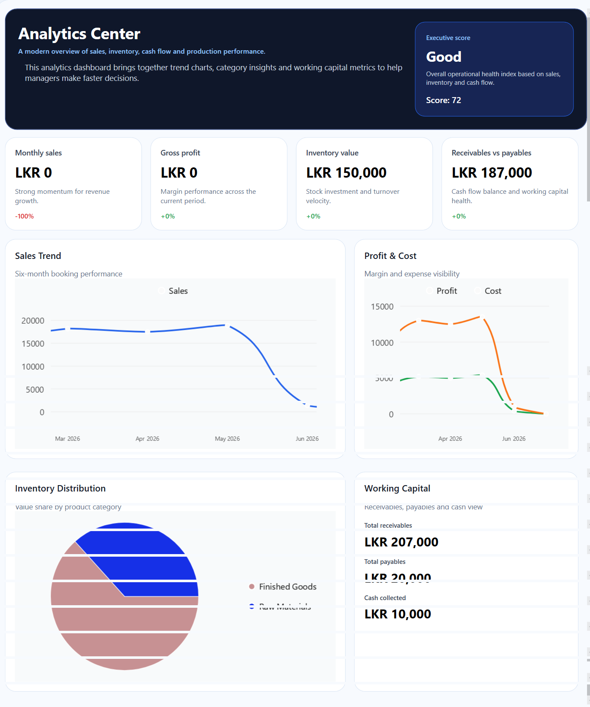
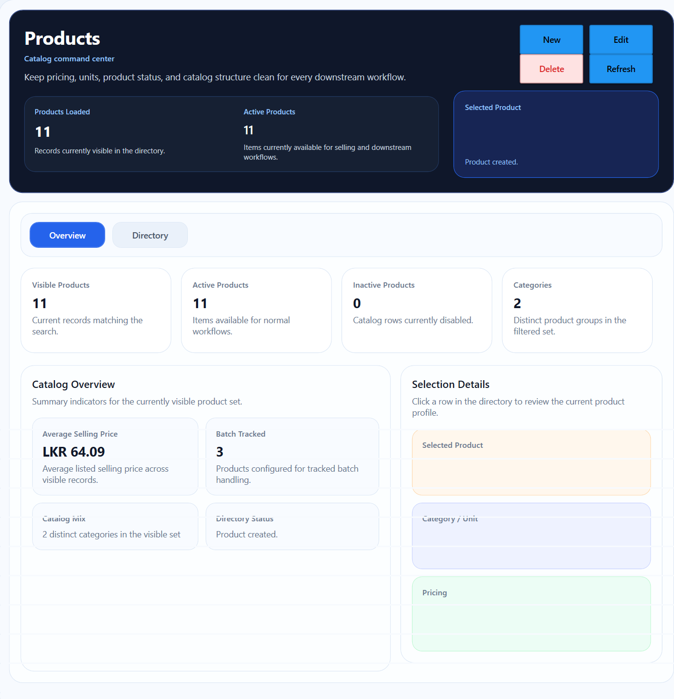
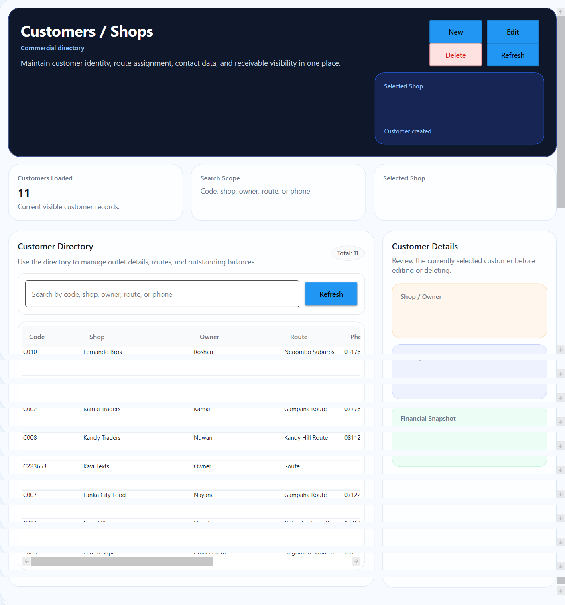
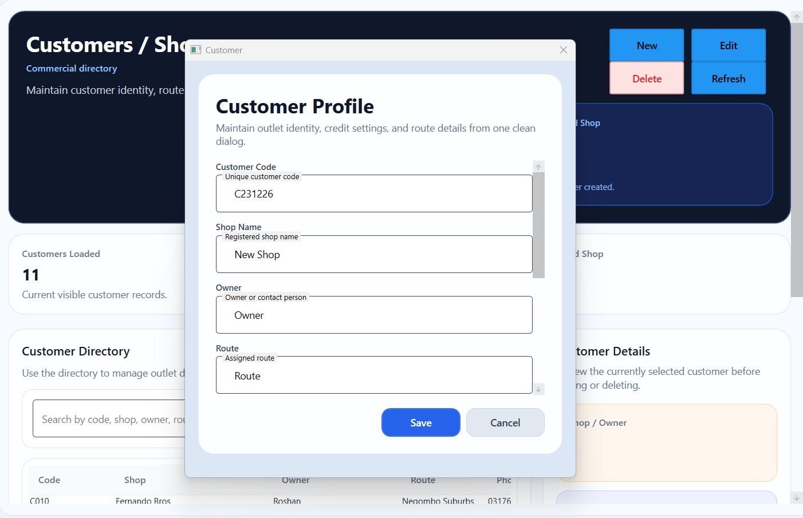
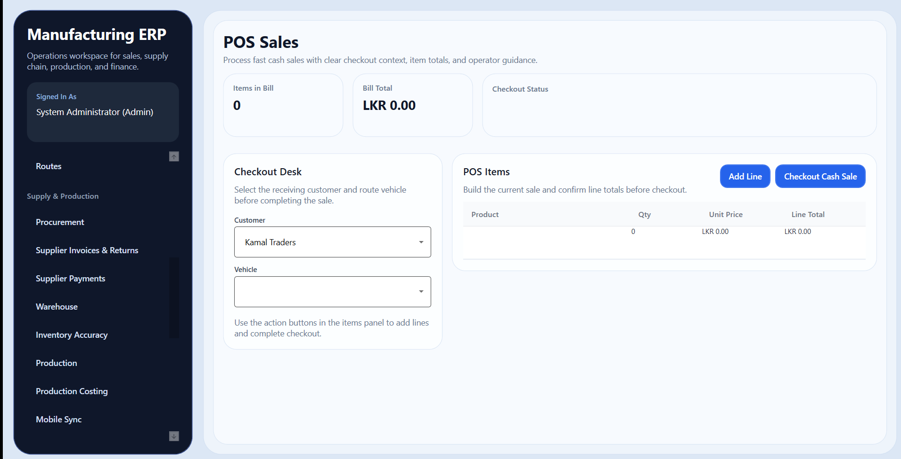
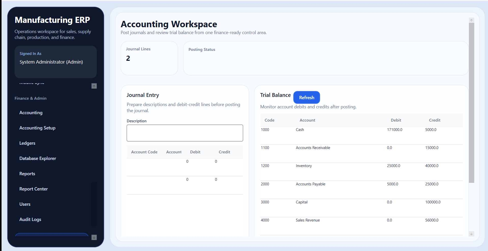
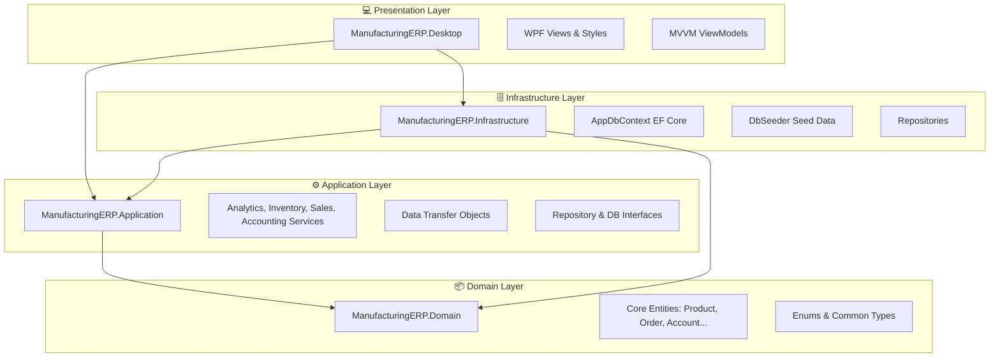

# 🏭 ManufacturingERP Desktop Solution

A comprehensive, production-ready ERP desktop application template designed for small-to-medium manufacturing operations. It features key modules spanning warehouse management, production control, route distribution, van sales, collections, and dual-layer accounting.

---

## 📸 Screenshots

---

## 🏗️ Solution Architecture

The solution is built using **Clean Architecture** principles, enforcing separation of concerns, testability, and a clear flow of dependencies.

### 🗂️ Layer Breakdown

1. **`ManufacturingERP.Desktop` (WPF UI)**
   * Built on the MVVM (Model-View-ViewModel) pattern using the `CommunityToolkit.Mvvm` package.
   * Utilizes `MaterialDesignThemes` for a modern, sleek dark/light themed interface.
   * Standardizes visual elements with customized styles (e.g. `Styles.xaml`).

2. **`ManufacturingERP.Application` (Services & Logic)**
   * Contains core application logic, services (like [AnalyticsService](file:///c:/Projects/ManufacturingERP/src/ManufacturingERP.Application/Services/AnalyticsService.cs)), and DTOs.
   * Defines interfaces and abstractions to decouple the domain from the underlying persistence layer.

3. **`ManufacturingERP.Domain` (Entities & Abstractions)**
   * Contains core domain models (e.g., `Product`, `Customer`, `ProductionOrder`, `Account`).
   * Expresses business rules, enums, and domain behavior without any external infrastructure dependencies.

4. **`ManufacturingERP.Infrastructure` (Data Persistence)**
   * Implements EF Core with SQLite backend for light-footprint local databases.
   * Configures tables, relations, and indexes in `AppDbContext`.
   * Integrates a seeder (`DbSeeder`) containing mock data for quick developer bootstrapping.

5. **`ManufacturingERP.Shared` (Utilities & Helpers)**
   * Houses project-wide cross-cutting helpers, constants, and utilities.

---
